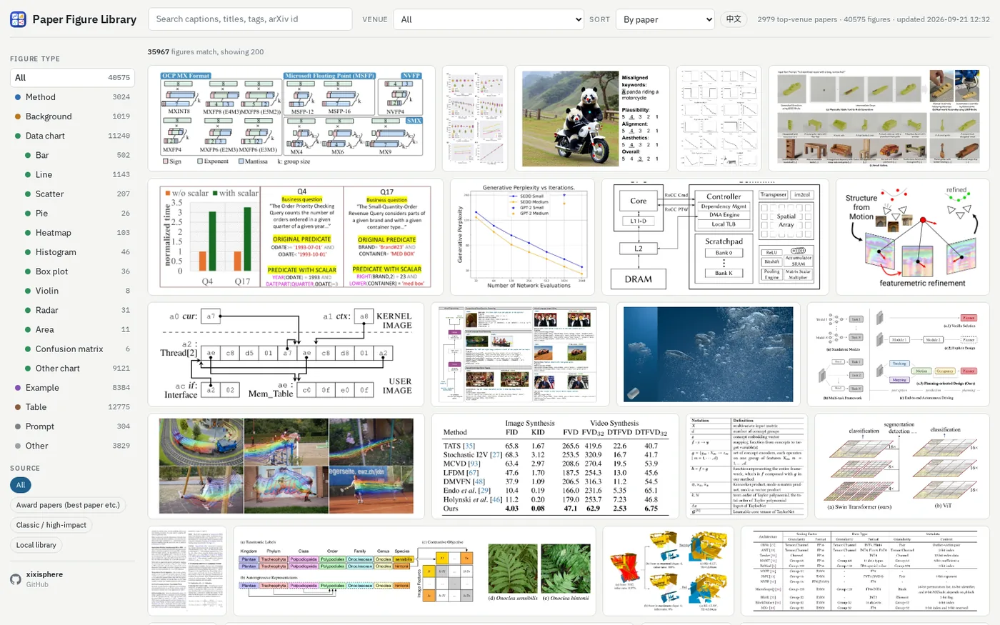
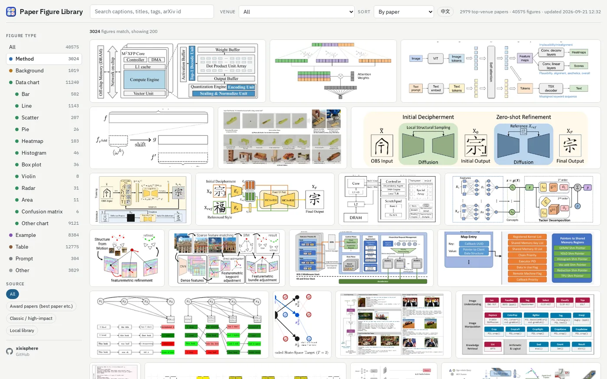
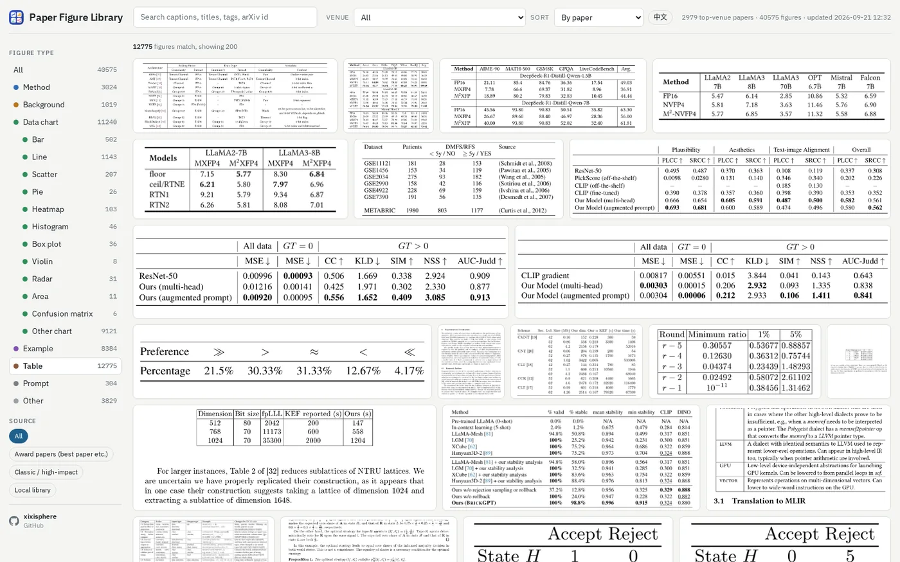
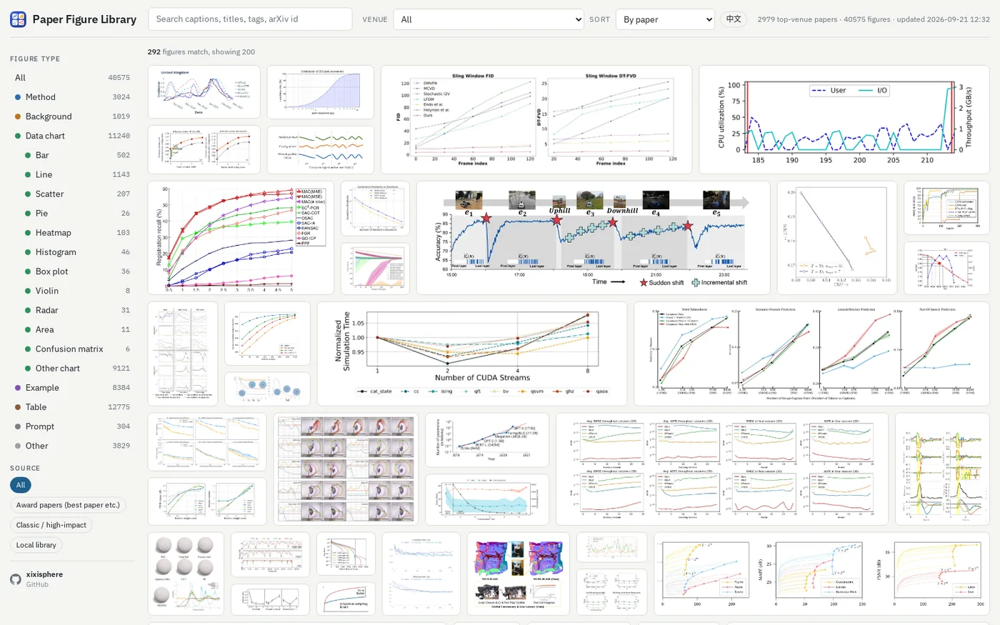
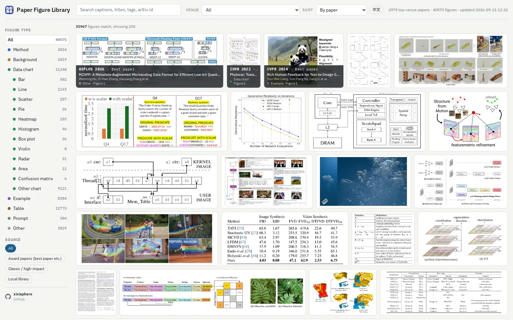
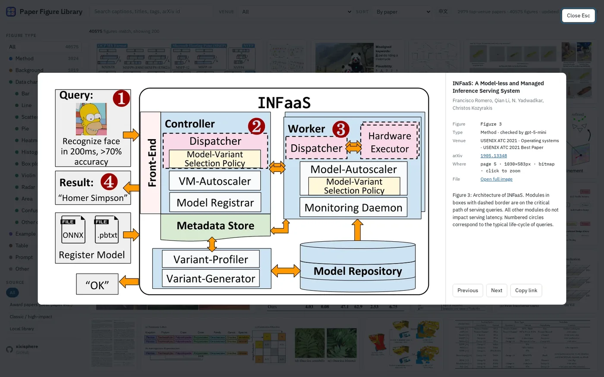
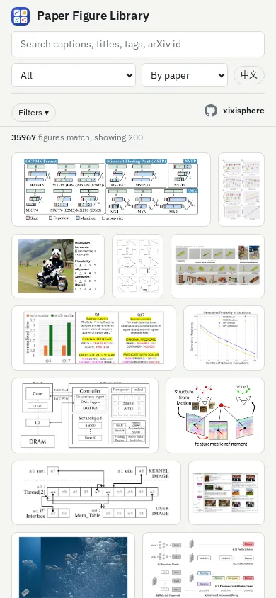

# PaperFigureLib

**Live: <https://paperfigure.net/>** (English entry: <https://paperfigure.net/en/>)

Asked AI to turn your paper into a figure, only to get a complete mess? Want to learn from the figure styles of top-tier conference papers, but are not sure where to find enough good examples? The ultimate collection of figures from top CS conferences is here!

PaperFigureLib collects and organizes high-quality figures from top computer science conference papers, with categories including method diagrams, model architectures, workflows, data visualizations, and experimental results. Whether you are looking for inspiration, designing a layout, or choosing reference figures for AI generation, you can quickly find examples that meet the visual standards of top-tier conference papers.

[](https://paperfigure.net/en/)

## What is inside

- **2,800+ papers, 38,000+ figures and tables**, from the best, outstanding and most cited papers of 2021 to 2026 at the top venues of every CSRankings area: ML, NLP, vision, AI, HCI, robotics, graphics, systems, networking, mobile, security, databases, PL, SE, HPC, theory, speech.
- Every figure is cropped from the PDF at 300 dpi, labelled by type (method diagram, background, data chart by subtype: bar, line, scatter, pie, heatmap, box, violin, radar, histogram, area, confusion matrix; example, prompt, table), and linked to its paper, venue, year and award.
- Multi-panel charts are split into single panels; tables are extracted as their own category.
- Filter by figure type, venue (grouped by area), award tier and drawing style; search captions, titles, tags and arXiv ids; every view has a shareable URL (`?cat=method&venue=CHI`, `#fig=<id>` opens one figure).

| Method diagrams | Tables |
|---|---|
| [](https://paperfigure.net/en/?cat=method) | [](https://paperfigure.net/en/?cat=table) |

| Line charts | Hover for venue, award, title and authors |
|---|---|
| [](https://paperfigure.net/en/?cat=data&chart=line) |  |

<p>


</p>

## How it works

1. `figlib fetch` downloads the papers in `seeds/*.txt` (award lists by area, high-impact classics, and `figlib seedgen` lists of the most cited open papers per venue from Semantic Scholar).
2. `figlib extract` finds every "Figure N" and "Table N" caption with PyMuPDF and crops the figure or table next to it at 300 dpi (WebP, plus a 960 px thumbnail).
3. `figlib classify` labels each figure with a vision model (type, chart subtype, style tags); `figlib verify` double-checks with a stronger model; `figlib split` cuts multi-panel charts into panels.
4. `figlib build` produces the gallery (one HTML file, no framework); `figlib site` writes a static site for hosting on Cloudflare Pages + R2 or any static host.

## Run it yourself

```bash
git clone https://github.com/fengxijia/PaperFigureLib && cd PaperFigureLib
python3 -m venv .venv && . .venv/bin/activate && pip install -r requirements.txt

python -m figlib.cli extract --pdf-dir ~/papers --jobs 3     # your own PDFs, no API key needed
python -m figlib.cli build
python -m uvicorn server:app --port 8131                     # http://127.0.0.1:8131/

python -m figlib.cli fetch --seeds seeds/best-papers-ml.txt  # add a curated seed list
python -m figlib.cli seedgen --area hci --out seeds/my-hci.txt   # or build one from Semantic Scholar
export OPENAI_API_KEY=sk-...                                  # or any OpenAI-compatible endpoint via OPENAI_BASE_URL
python -m figlib.cli classify --jobs 3 && python -m figlib.cli split && python -m figlib.cli classify --jobs 3
python -m figlib.cli build
```

Data lives in `./data` (override with `FIGLIB_DATA`). Seed lines are an arXiv id or a PDF URL followed by a comment with the venue and award, e.g. `2005.14165   # NeurIPS 2020 · Language Models are Few-Shot Learners`.

## Deploy the site

```bash
cp site.env.example site.env            # domain, Cloudflare account id and API token
python deploy/cf-setup.py site.env      # once: R2 bucket, Pages project, domains, DNS
bash deploy/publish-site.sh cloudflare  # figures to R2, page to Pages
```

## License

Code: MIT. Figures belong to the authors of the papers; every figure links to its source.

---

把论文丢给AI画图，结果画得一团糟？想要参考顶会论文的画图风格，却担心找不全？

那么，我们顶会论文图表大全来了。

PaperFigureLib 收集并整理了计算机科学顶会论文中的优秀图表，按照方法图、模型架构图、流程图、数据图、实验结果图等类别进行归档。无论你是在寻找灵感、设计版式，还是为 AI 绘图挑选参考模板，都可以从这里快速找到真正经得起顶会审美检验的范例。中文入口：<https://paperfigure.net/>。
